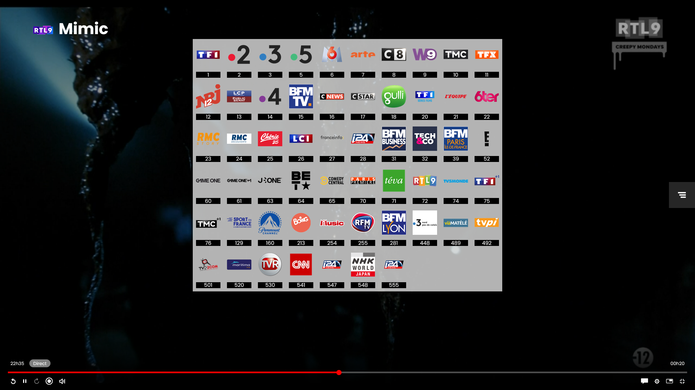
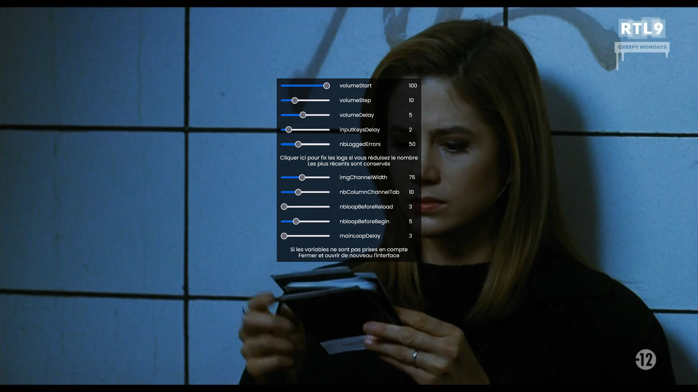
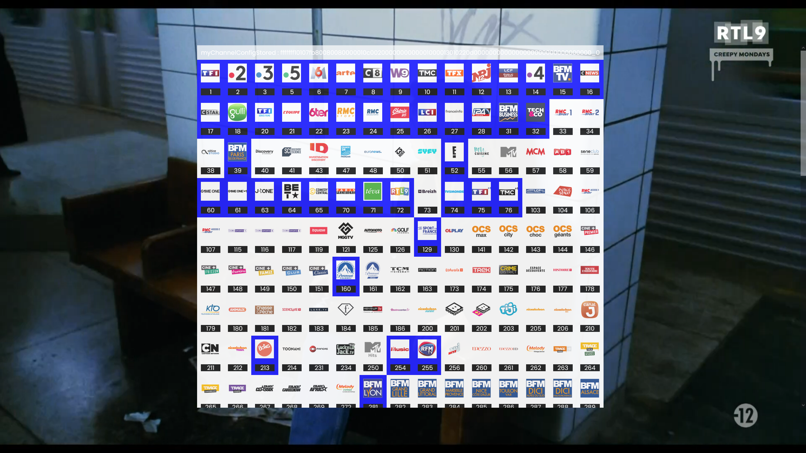
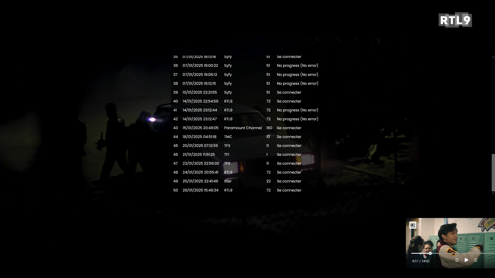
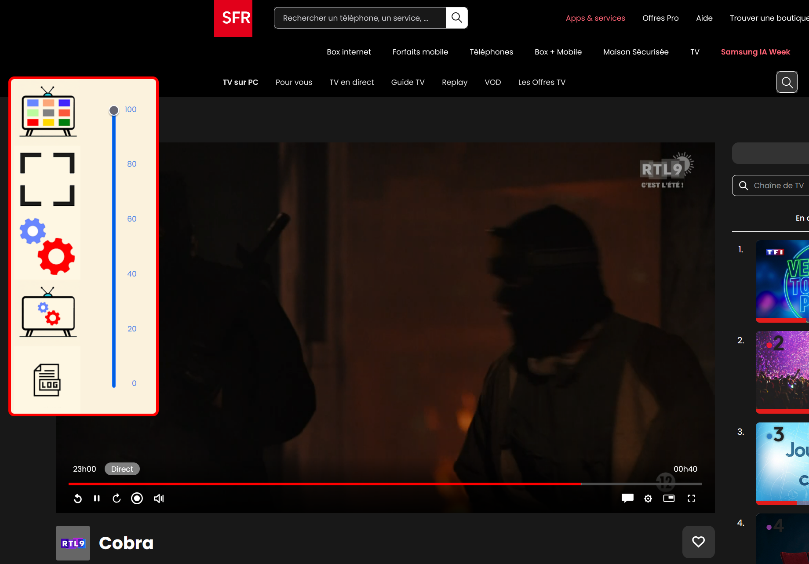

 C'est un userscript à charger avec une extension dans un navigateur WEB.
 Gerer certaines erreurs, personalisation de l'interface utilisateur.
 

# Navigation au clavier

 "+" ou la flèche droite pour la chaine suivante
 "-" ou la flèche gauche pour la précédente
 Avec les chiffres ( pavé numérique ou pas ) comme une télécommande
 La touche entrée numérique ou la touche contrôle gauche affiche ou ferme une mosaïque de vignettes (cliquer pour changer la chaine)
 Passer en mode plein écran ou fenêtré avec le point du pavé numérique ou la touche majuscule gauche
 
 Gestion du volume sonore avec les flèches , haut pour augmenter , bas pour diminuer
 Interface de configuration du tableau de vignettes , appuyer sur "V"
 Interface de configuration , appuyer sur C
 Logs erreurs , appuyer sur L
 
 

# Navigation à la souris

 Mettre la souris sur le bord gauche de l'écran fait apparaître le menu
 Ajout de boutons pour fermer les menus
 Ajout d'un slider pour la gestion du son

# Liste des chaines

# Interface de configuration

# Interface de configuration du tableau de vignettes

# Logs erreurs

# Menu

